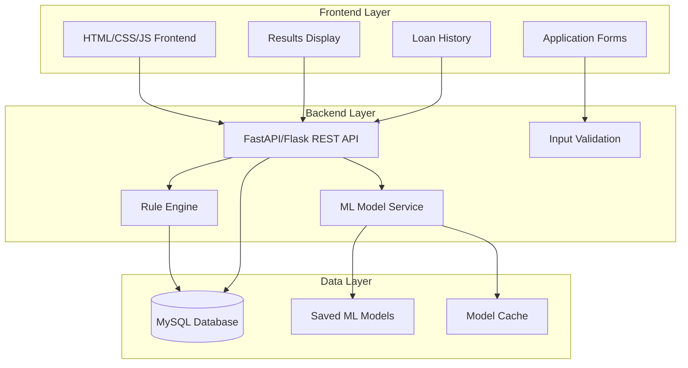

# Design Document

## Overview

The Credit Risk & Loan Approval System is designed as a three-tier architecture with a React-like vanilla JavaScript frontend, Python backend API, and MySQL database. The system integrates machine learning models for risk assessment and implements both rule-based and ML-driven decision making. The architecture emphasizes modularity, scalability, and maintainability while providing a professional banking experience.

## Architecture

### High-Level Architecture



### Technology Stack

- **Frontend**: Vanilla HTML5, CSS3, JavaScript (ES6+)
- **Backend**: FastAPI (Python 3.8+)
- **Database**: MySQL 8.0+
- **ML Framework**: scikit-learn, pandas, numpy
- **Model Persistence**: joblib
- **HTTP Client**: Fetch API
- **Styling**: Modern CSS with Flexbox/Grid

## Components and Interfaces

### Frontend Components

#### 1. Application Form Component
- **Purpose**: Collect customer financial information
- **Files**: `loan-application.html`, `application-form.js`, `form-styles.css`
- **Key Features**:
  - Real-time input validation
  - Progressive form enhancement
  - Responsive design
  - Error message display

#### 2. Results Display Component
- **Purpose**: Show loan approval decision and terms
- **Files**: `approval-result.html`, `results-display.js`, `results-styles.css`
- **Key Features**:
  - Decision visualization (Approved/Rejected/Manual Review)
  - Risk category display with color coding
  - Loan terms presentation
  - Action buttons for next steps

#### 3. Loan History Component
- **Purpose**: Display customer's loan application history
- **Files**: `loan-history.html`, `history-display.js`, `history-styles.css`
- **Key Features**:
  - Tabular data display
  - Sorting and filtering
  - Status indicators
  - Pagination for large datasets

### Backend Components

#### 1. API Router (`app/routers/`)
- **loan_router.py**: Handles loan application endpoints
- **customer_router.py**: Manages customer-related operations
- **health_router.py**: System health and status checks

#### 2. Services Layer (`app/services/`)
- **loan_service.py**: Core loan processing logic
- **rule_engine.py**: Rule-based validation service
- **ml_service.py**: Machine learning prediction service
- **risk_assessment.py**: Risk categorization and term calculation

#### 3. Data Access Layer (`app/repositories/`)
- **customer_repository.py**: Customer data operations
- **loan_repository.py**: Loan application data operations
- **base_repository.py**: Common database operations

#### 4. Models (`app/models/`)
- **customer.py**: Customer data model
- **loan_application.py**: Loan application data model
- **ml_prediction.py**: ML prediction result model

### API Endpoints

```
POST /api/v1/loans/apply
- Submit new loan application
- Request: CustomerData + LoanRequest
- Response: ApplicationID + Status

GET /api/v1/loans/{application_id}/decision
- Get loan decision and terms
- Response: Decision + RiskCategory + Terms

GET /api/v1/customers/{customer_id}/history
- Retrieve loan history
- Response: List[LoanApplication]

POST /api/v1/ml/predict
- Internal ML prediction endpoint
- Request: FeatureVector
- Response: Prediction + Probability

GET /api/v1/health
- System health check
- Response: SystemStatus
```

## Data Models

### Database Schema

```sql
-- Customers table
CREATE TABLE customers (
    id INT PRIMARY KEY AUTO_INCREMENT,
    name VARCHAR(255) NOT NULL,
    age INT NOT NULL,
    salary DECIMAL(12,2) NOT NULL,
    credit_score INT NOT NULL,
    created_at TIMESTAMP DEFAULT CURRENT_TIMESTAMP,
    updated_at TIMESTAMP DEFAULT CURRENT_TIMESTAMP ON UPDATE CURRENT_TIMESTAMP,
    INDEX idx_credit_score (credit_score),
    INDEX idx_salary (salary)
);

-- Loan applications table
CREATE TABLE loan_applications (
    id INT PRIMARY KEY AUTO_INCREMENT,
    customer_id INT NOT NULL,
    loan_amount DECIMAL(12,2) NOT NULL,
    existing_loans INT DEFAULT 0,
    monthly_income DECIMAL(12,2) NOT NULL,
    employment_years INT NOT NULL,
    application_date TIMESTAMP DEFAULT CURRENT_TIMESTAMP,
    status ENUM('pending', 'approved', 'rejected', 'manual_review') NOT NULL,
    risk_category ENUM('low', 'medium', 'high') NULL,
    decision_reason TEXT,
    FOREIGN KEY (customer_id) REFERENCES customers(id),
    INDEX idx_status (status),
    INDEX idx_application_date (application_date)
);

-- Loan terms table
CREATE TABLE loan_terms (
    id INT PRIMARY KEY AUTO_INCREMENT,
    application_id INT NOT NULL,
    approved_amount DECIMAL(12,2),
    interest_rate DECIMAL(5,2),
    tenure_months INT,
    monthly_payment DECIMAL(12,2),
    created_at TIMESTAMP DEFAULT CURRENT_TIMESTAMP,
    FOREIGN KEY (application_id) REFERENCES loan_applications(id)
);

-- ML predictions table
CREATE TABLE ml_predictions (
    id INT PRIMARY KEY AUTO_INCREMENT,
    application_id INT NOT NULL,
    model_name VARCHAR(100) NOT NULL,
    prediction VARCHAR(50) NOT NULL,
    probability_score DECIMAL(5,4) NOT NULL,
    feature_vector JSON,
    created_at TIMESTAMP DEFAULT CURRENT_TIMESTAMP,
    FOREIGN KEY (application_id) REFERENCES loan_applications(id),
    INDEX idx_model_prediction (model_name, prediction)
);
```

### Python Data Models

```python
# Customer model
@dataclass
class Customer:
    id: Optional[int]
    name: str
    age: int
    salary: float
    credit_score: int
    created_at: Optional[datetime]

# Loan application model
@dataclass
class LoanApplication:
    id: Optional[int]
    customer_id: int
    loan_amount: float
    existing_loans: int
    monthly_income: float
    employment_years: int
    status: str
    risk_category: Optional[str]
    decision_reason: Optional[str]

# ML prediction model
@dataclass
class MLPrediction:
    model_name: str
    prediction: str
    probability_score: float
    feature_vector: Dict[str, float]
```

## Error Handling

### Frontend Error Handling
- **Validation Errors**: Real-time field validation with specific error messages
- **Network Errors**: Retry mechanisms with user feedback
- **Server Errors**: Graceful degradation with fallback options
- **Loading States**: Progress indicators during API calls

### Backend Error Handling
- **Input Validation**: Pydantic models for request validation
- **Database Errors**: Connection pooling and retry logic
- **ML Model Errors**: Fallback to rule-based decisions
- **API Errors**: Structured error responses with error codes

```python
# Error response structure
{
    "error": {
        "code": "VALIDATION_ERROR",
        "message": "Invalid input data",
        "details": {
            "field": "credit_score",
            "issue": "Must be between 300 and 850"
        }
    }
}
```

## Testing Strategy

### Frontend Testing
- **Unit Tests**: Individual component testing with Jest-like framework
- **Integration Tests**: Form submission and API interaction tests
- **UI Tests**: Cross-browser compatibility testing
- **Accessibility Tests**: WCAG compliance validation

### Backend Testing
- **Unit Tests**: Service layer and utility function tests using pytest
- **Integration Tests**: Database operations and API endpoint tests
- **ML Model Tests**: Model accuracy and prediction consistency tests
- **Load Tests**: API performance under concurrent requests

### Test Data Strategy
- **Synthetic Dataset**: Generated realistic financial data for ML training
- **Test Fixtures**: Predefined test cases for various scenarios
- **Mock Services**: Isolated testing of individual components
- **End-to-End Tests**: Complete loan application flow validation

### ML Model Validation
- **Cross-Validation**: K-fold validation during training
- **Performance Metrics**: Accuracy, Precision, Recall, F1-score
- **Model Comparison**: Random Forest vs Logistic Regression performance
- **Bias Testing**: Fairness across different demographic groups

## Security Considerations

### Data Protection
- **Input Sanitization**: SQL injection and XSS prevention
- **Data Encryption**: Sensitive data encryption at rest
- **API Security**: Rate limiting and authentication headers
- **CORS Configuration**: Proper cross-origin resource sharing setup

### Privacy Compliance
- **Data Minimization**: Collect only necessary information
- **Audit Logging**: Track all data access and modifications
- **Data Retention**: Implement data lifecycle management
- **Consent Management**: Clear privacy policy and user consent

## Performance Optimization

### Frontend Optimization
- **Code Splitting**: Lazy loading of non-critical components
- **Caching Strategy**: Browser caching for static assets
- **Minification**: CSS and JavaScript compression
- **Image Optimization**: Responsive images and modern formats

### Backend Optimization
- **Database Indexing**: Optimized queries with proper indexes
- **Connection Pooling**: Efficient database connection management
- **Model Caching**: In-memory caching of loaded ML models
- **Response Compression**: Gzip compression for API responses

### ML Model Optimization
- **Model Size**: Optimized models for faster loading
- **Prediction Caching**: Cache predictions for similar inputs
- **Batch Processing**: Efficient batch prediction capabilities
- **Model Versioning**: Support for model updates without downtime